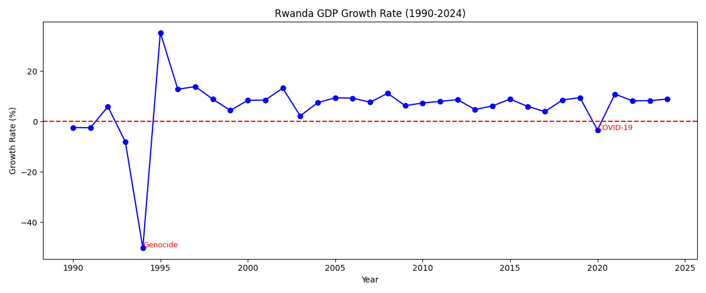
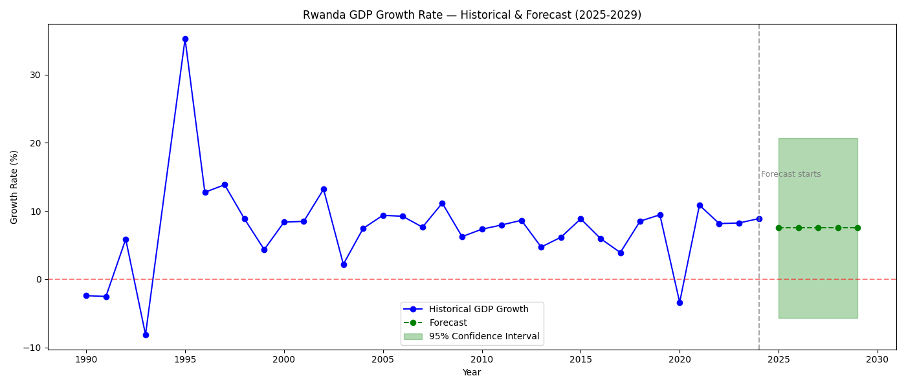

# 🇷🇼 EconForecast — Rwanda GDP Growth Forecasting

## Overview
This project forecasts Rwanda's GDP growth rate using ARIMA time series modeling, 
based on World Bank data from 1990 to 2024.

## Problem Statement
Can we forecast Rwanda's future GDP growth rate using historical patterns? 
This project applies time series analysis to answer this question.

## Data Source
- **World Bank API** — Annual GDP Growth Rate, GDP (Current USD), GDP Per Capita
- **Period:** 1990 — 2024
- **Country:** Rwanda (RWA)

## Methodology
1. Data Collection via World Bank API (`wbdata`)
2. Exploratory Data Analysis & Visualization
3. Stationarity Testing (ADF Test — p-value: 0.000000023 ✅)
4. ACF/PACF Analysis
5. ARIMA Model Selection & Training
6. Forecast 2025–2029

## Key Findings
- Rwanda's GDP growth rate is **stationary** and mean-reverting around **~7.5%**
- Notable shocks: **1994 Genocide (-50%)** and **2020 COVID-19 (-3.4%)**
- **Forecast:** Rwanda is projected to maintain ~7.5% annual growth through 2029

## Results



## How to Run
```bash
# Clone the repo
git clone https://github.com/Pierre-2/EconForecast.git
cd EconForecast

# Install dependencies
pip install -r Requirements.txt

# Open notebooks
jupyter notebook Notebook/
```

## Requirements
See `Requirements.txt`

## Author
**Jean Pierre NIYOMUGABO** — [GitHub](https://github.com/Pierre-2)

## License
MIT
